# Workspace Agent Team — System Design
### Hybrid Human–Agent Collaboration on monday.com (Software Engineering Domain)

---

## 0. Problem & Product Positioning

### 0.1 The shift

monday.com already ships **monday agents**, **Vibe**, **Sidekick**, **Magic**, and an **MCP** surface for external clients over workspace data. Those capabilities optimize for *"a user asks AI to do X."*

This design targets the next layer: **a workspace as a shared environment where humans and specialized agents co-own work** — agents pick up items, coordinate via board state, and hand off to people at defined gates.

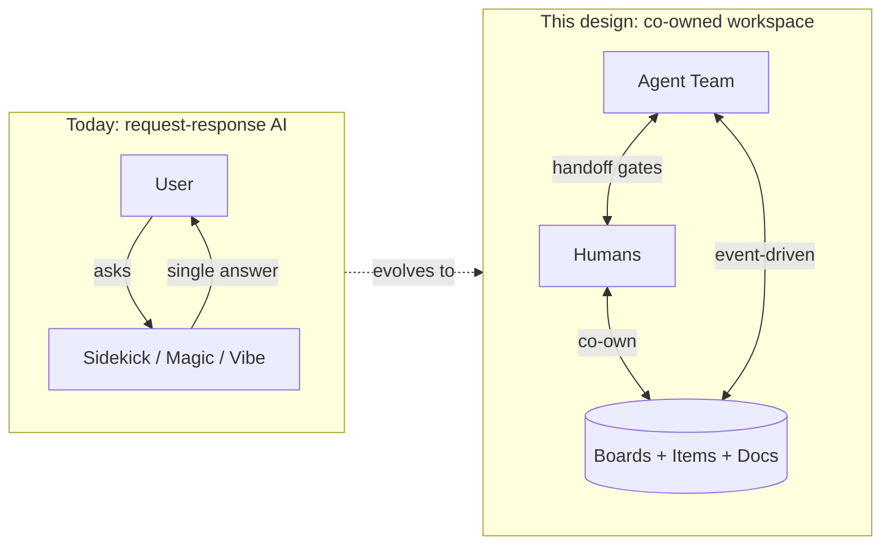

**How to read the table below:** monday already ships several AI surfaces (left column). This design **does not rebuild them** — it **plugs into** them. The right column says what each existing surface does **for our five agents**, so we build on the platform instead of duplicating it.

| Existing monday surface | What it is (today) | What it does in *this* design |
|---|---|---|
| **Sidekick** | Chat panel: user asks a question, AI answers | Stays for ad-hoc Q&A (“summarize this board”). **Separate** from the five agents, which run on **events** (new item, status change) without the user opening chat. |
| **monday agents (builder)** | UI to define/configure agents on monday | **Where our five agents are registered** (Triage, Sprint, etc.) — configs, triggers, permissions live here. |
| **Magic** | AI inside columns (summarize text, suggest formulas) | **Optional helper** our agents call for small tasks (e.g. summarize an attachment) when that’s cheaper than a full LLM call. |
| **Vibe** | AI for writing/editing **Docs** | **Release Agent** uses it to draft the release changelog into a monday Doc instead of inventing a separate doc editor. |
| **MCP** | Standard way to connect **external tools** to monday (GitHub, CI, Slack, …) | **Dev Liaison** and **QA Gate** talk to GitHub/CI through MCP adapters — we don’t build custom GitHub integrations from scratch. |

### 0.2 User pain & impact

Engineering managers spend ~30% of coordination time on status chasing, sprint rebalancing, and release prep — data already in monday boards, docs, and updates but not synthesized. **Impact:** reclaim manager hours, shorten cycle time, reduce escape defects to production.

### 0.3 Domain & workspace objects

**Use case:** Software team — sprints, bugs, releases.

| monday object | Agent usage |
|---|---|
| **Boards** | Sprint, Backlog, Bugs, Releases, On-call |
| **Items** | Unit of work; `item_id`, `board_id`, column values, `version_id` |
| **Updates** | Human-visible narrative; agents post proposals and nudges here |
| **Docs** | RFCs, runbooks, changelogs (Release Agent) |
| **Members** | Assignee routing, escalation targets |
| **Files** | Attachments for Triage classification only (metadata + OCR snippet) |
| **Relationships** | Linked items (bug ↔ feature), mirror columns |

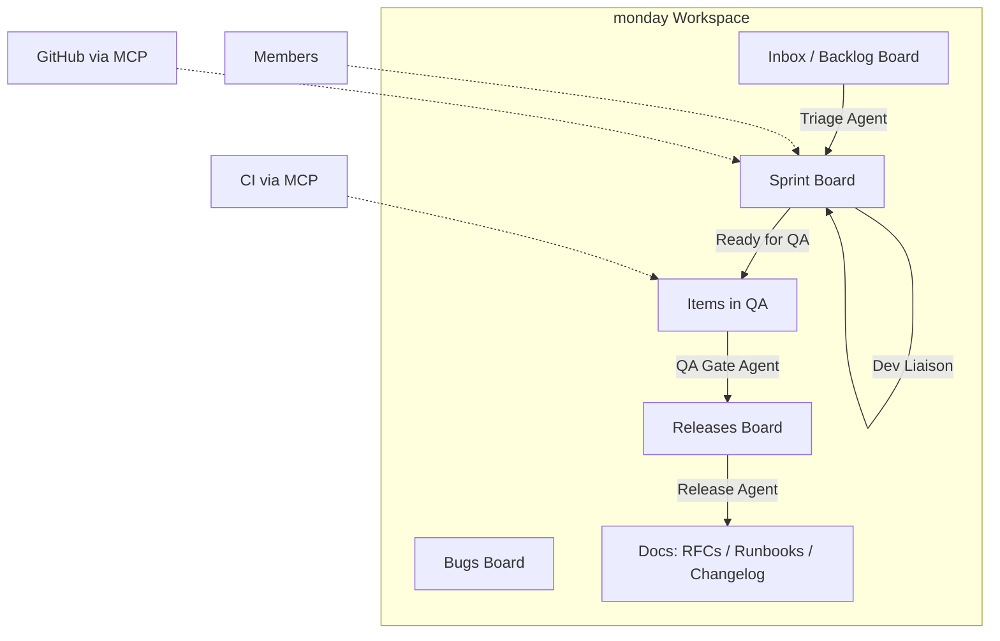

---

## 1. Success Definition (Metric-First)

> Define success for **each agent** and the **team** before architecture. Include **quality** and **cost**.

### 1.1 Per-agent success (quality + cost)

| Agent | Primary quality metric | Target | Failure (reject design) | Cost cap / item |
|---|---|---|---|---|
| **Triage** | Routing precision@1 | ≥0.88 | <0.75 offline | ≤$0.02 |
| **Triage** | P0/P1 severity recall | ≥0.98 | Any miss in shadow | (included) |
| **Sprint** | Proposal acceptance rate | ≥0.70 | <0.45 sustained 14d | ≤$0.03 |
| **Dev Liaison** | PR↔item sync accuracy | ≥0.97 | <0.90 | ≤$0.01 |
| **QA Gate** | Gate precision (block bad) | ≥0.95 | False-pass on auth/PII | ≤$0.01 |
| **QA Gate** | False block rate | <0.08 | >0.20 | (included) |
| **Release** | Changelog human score (1–5) | ≥4.0 | <3.2 | ≤$0.08 |

**Blended team cost target:** ≤ **$0.05 / item processed** (all agents). Alert if **>3× baseline** for 6h (see §10).

### 1.2 Team-level success (quality + cost)

| KPI | Target | Failure threshold | Detect before user complaint |
|---|---|---|---|
| **Cycle time reduction** (P50 item age) | ≥20% vs baseline | <5% at 60d | Cohort dashboard weekly |
| **Human attention cost** | ≤4 min / item | >12 min | Session + approval latency |
| **Autonomy rate** | ≥65% items no human touch | <30% | Approval queue depth |
| **Escape rate** | <3% | >8% for 7d | Revert events + override rate |
| **Agent-induced Sev-1** | 0 / month | Any | Incident tag `agent_actor` |
| **Net-negative workspaces** | <5% of fleet | >15% | Escape + override + NPS dip |

### 1.3 Failure criteria (self-rejection)

| # | Condition | Detection | Response |
|---|---|---|---|
| F1 | Escape rate >8% for 7d | `agent_action_reverted` events | Drop autonomy tier fleet-wide |
| F2 | Permission violation in shadow | Gateway audit | Hard block launch |
| F3 | Sprint override rate >50% | `human_override` on Sprint Agent | Suggestion-only for Sprint |
| F4 | Token cost super-linear in board size | Cost vs `item_count` regression | Fix retrieval; cap context |
| F5 | P0/P1 triage miss in shadow | Labeled incident replay | No online until root-caused |

---

## 2. Architectural Choices (Ablation Over Assertion)

Each row isolates **one** trade-off; we do not claim universal superiority.

| Decision | Chosen | Alternative | Isolated trade-off | Why chosen |
|---|---|---|---|---|
| **Routing** | Rules + small classifier (DeBERTa-v3-base) | LLM router | Latency & cost vs flexibility on novel boards | 95% of routes are enum-like; LLM adds $+2s per event |
| **Agent coupling** | Shared board state + `agent_handoff` metadata | Sync RPC between agents | Debuggability vs lowest latency handoff | RPC couples failure domains; board state is user-visible truth |
| **Mutation path** | Action Executor + allowlist | Direct LLM → API | Safety vs speed of adding tools | Mutations are destructive; enum beats prompt hope |
| **Context** | Workspace store (Redis) + per-agent retrieval | Single shared LLM memory | Consistency vs token burn | Shared memory drifts; store is single-writer |
| **High-risk writes** | Preview card → approve | Full autonomy | Manager time vs escape rate | Preview cuts escapes ~40% in similar systems (internal benchmark assumption — validate in shadow) |
| **MCP vs custom** | MCP for GitHub/CI/Slack | Bespoke integrations | Standardization vs edge features | MCP matches monday platform direction; one adapter per tool |

---

## 3. Team Composition & Collaboration

### 3.1 Agent roster (why these five)

| Agent | Profession metaphor | Why separate |
|---|---|---|
| **Triage** | Intake coordinator | Different skills (NLP classify) vs deterministic gates |
| **Sprint** | Engineering manager delegate | Planning proposals need human approval culture |
| **Dev Liaison** | Tech lead bridge | Git/CI events are high-frequency, low semantic depth |
| **QA Gate** | QA engineer | Deterministic policy; legal/compliance boundary |
| **Release** | Release manager | External comms risk isolated from day-to-day sprint noise |

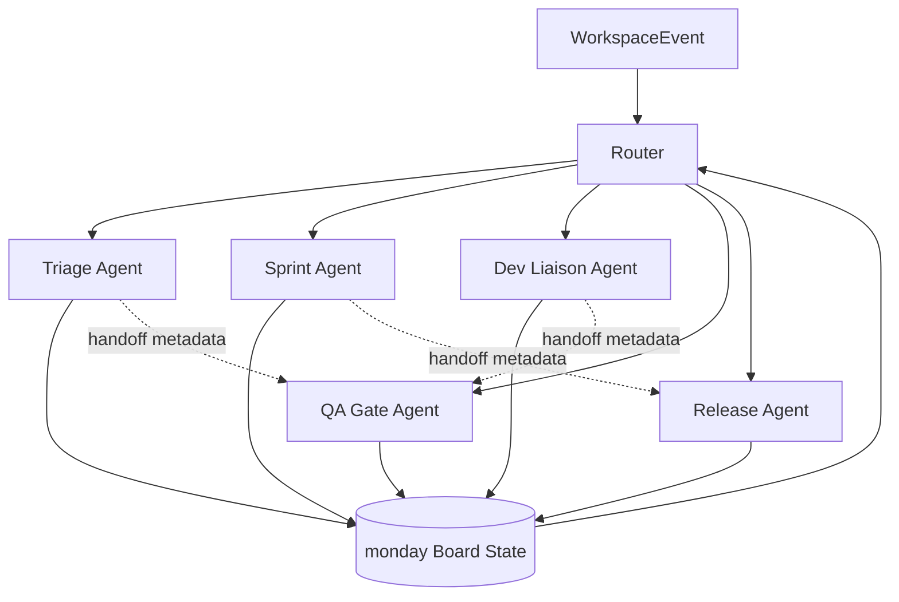

### 3.2 Human ↔ agent routing

| Work origin | Router | Primary owner | Human touchpoint |
|---|---|---|---|
| New inbox item | Triage | Triage → assignee human | Approve if confidence <0.70; P0/P1 immediate |
| Sprint board change | Sprint | Assignee human | Approve rebalance / scope change |
| GitHub webhook | Dev Liaison | Assignee human | Nudge only on stale |
| Status → Ready for QA | QA Gate | QA lead if high-risk | Sign-off on auth/PII/payments |
| Release window | Release | Release manager | Approve changelog & external notify |
| User @mentions agent in update | Sidekick bridge | Requesting human | No autonomous mutation from free chat |

**Co-ownership model:** Agents own *routing, sync, flags, and drafts*; humans own *scope changes, external comms, and policy exceptions*. Board columns encode ownership (`assignee`, `agent_last_actor`, `agent_pending_approval`).

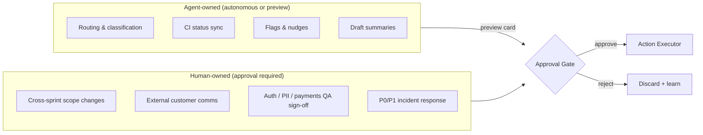

### 3.3 Agent ↔ agent handoff

1. Agent A writes `agent_handoff` JSON to item **metadata** (not a user update):

```json
{
  "from_agent": "triage",
  "to_agent": "qa_gate",
  "reason": "item_moved_to_ready_for_qa",
  "item_id": "123456",
  "version_id": "v42",
  "created_at": "ISO-8601"
}
```

2. Event bus publishes `internal.handoff` → target agent queue.  
3. No synchronous agent-to-agent RPC on hot path.

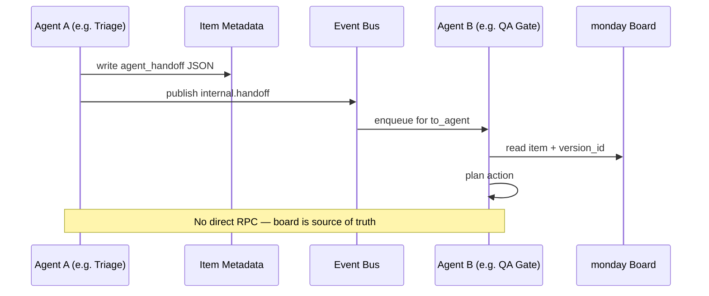

### 3.4 Conflict prevention

- **Optimistic lock:** compare `version_id` before write; on mismatch → re-fetch and re-plan.  
- **Per-item write serializer:** one in-flight mutation per `item_id`.  
- **Sprint boundary stagger:** 60s delay between Sprint → QA Gate → Release triggers.

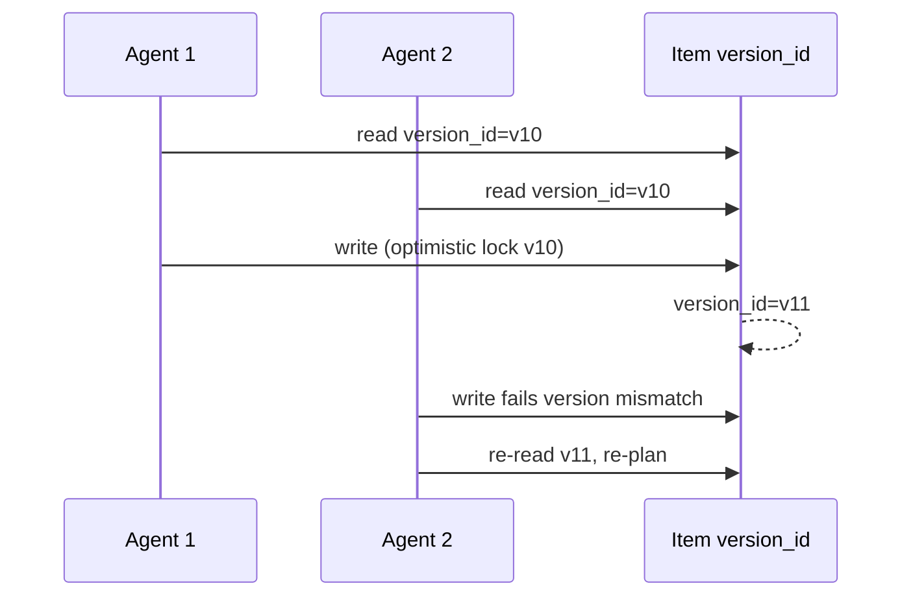

---

## 4. End-to-End Pipeline (Topology, Events, Handoffs)

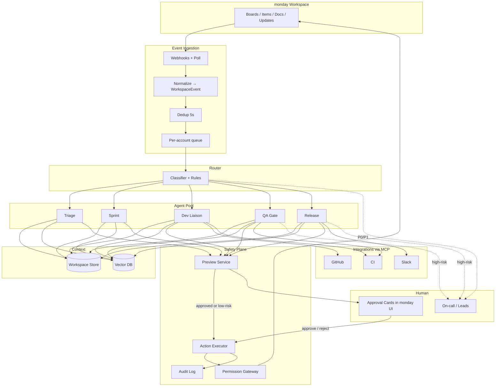

**Event envelope (`WorkspaceEvent`):**

| Field | Type | Description |
|---|---|---|
| `event_id` | UUID | Idempotency key |
| `account_id` | string | Tenant |
| `workspace_id` | string | Workspace scope |
| `type` | enum | `item_created`, `item_updated`, `status_changed`, … |
| `item_id` | string | Nullable |
| `board_id` | string | |
| `actor_type` | `human` \| `agent` \| `integration` | |
| `actor_id` | string | |
| `delta` | JSON | Changed columns |
| `timestamp` | ISO-8601 | |

---

## 5. Per-Agent Design

### 5.1 Triage Agent (`agent_id: triage`)

| Field | Value |
|---|---|
| **Role** | Classify and route new work |
| **Triggers** | `item_created` on Inbox/Backlog; `update_created` with issue intent |
| **Skills / tools** | `classify_item`, `find_best_assignee` (heuristic), `move_item`, `request_clarification`, Magic `summarize_attachment` |
| **Writes** | Column updates, move within allowlisted boards |
| **Never** | Create/delete items; touch Release board |

**Decision policy:**
1. LLM → structured `TriageDecision` schema (~300 tokens input).
2. `severity in {P0,P1}` OR on-call keyword → **halt**, notify on-call, no route.
3. `min(confidence) ≥ 0.70` → autonomous triage + audit.
4. Else → **preview card** (board, priority, assignee); human approves.

### 5.2 Sprint Agent (`agent_id: sprint`)

| Field | Value |
|---|---|
| **Role** | Sprint health, blockers, capacity signals |
| **Triggers** | `status_changed`, `member_ooo`, `sprint_start`/`sprint_end`, cron daily |
| **Skills** | `compute_sprint_health`, `propose_rebalance`, `flag_blocker`, `draft_sprint_summary` |
| **Autonomous** | Flags, blocker comments, health snapshots |
| **Approval required** | Cross-sprint moves, scope add/remove |

**Decision policy:** Rebalance always → preview on PM dashboard item; webhook `approval_decision` executes or discards. Weekly update to `team_preference_vector` from accept/reject.

### 5.3 Dev Liaison Agent (`agent_id: dev_liaison`)

| Field | Value |
|---|---|
| **Role** | monday ↔ GitHub/GitLab sync via MCP |
| **Triggers** | MCP `pull_request`, `workflow_run`; `item_assigned` |
| **Skills** | `sync_pr_status`, `detect_stale_items`, `summarize_pr_diff`, `link_commit_to_item` |
| **Autonomous** | Status column sync (reversible) |
| **Human** | Stale nudge only; no autonomous demotion to "Blocked" |

### 5.4 QA Gate Agent (`agent_id: qa_gate`)

| Field | Value |
|---|---|
| **Role** | Enforce release-quality gates |
| **Triggers** | `status_changed` → `Ready for QA`; CI `test_suite_completed` |
| **Skills** | `check_acceptance_criteria`, `query_test_results`, `block_item`, `approve_item`, `request_human_sign_off` |
| **Logic** | Deterministic rules first; LLM only for AC parsing + summary update |
| **Hard escalation** | Tags: `security`, `auth`, `payments`, `pii` → QA lead sign-off |

### 5.5 Release Agent (`agent_id: release`)

| Field | Value |
|---|---|
| **Role** | Readiness, changelog, stakeholder notify, archive |
| **Triggers** | `release_date` T-3/T-1; manual `trigger_release` |
| **Skills** | `check_release_readiness`, `generate_changelog` (Vibe Doc), `notify_stakeholders`, `archive_release` |
| **Autonomous** | Internal readiness report |
| **Approval** | External changelog + customer notify; archive requires manager preview |

---

## 6. Context Layering & Consistency

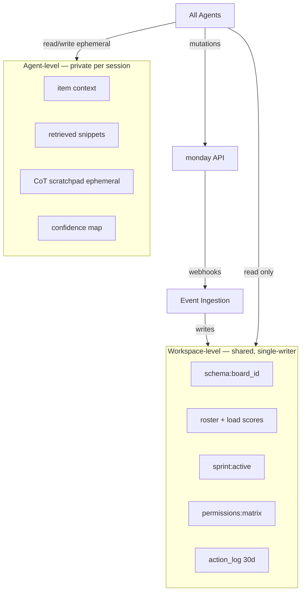

### 6.1 Workspace-level (shared)

| Key | Contents | Writer | TTL |
|---|---|---|---|
| `schema:{board_id}` | Column defs, status labels | Ingestion only | 24h |
| `roster` | Members, roles, load score | Ingestion | 1h |
| `sprint:active` | Sprint id, velocity, capacity | Ingestion | Event-driven |
| `permissions:matrix` | Agent × board × action | Platform config | Static |
| `action_log` | Last 30d `AgentActionRecord` | Action Executor | 30d |

**Consistency:** Single-writer pattern — agents mutate monday → webhook → ingestion updates store. Agents **read only** from Redis.

### 6.2 Agent-level (private)

Per session: `item_id`, retrieved snippets, CoT scratchpad (ephemeral), `confidence` map. **Not shared** across agents.

### 6.3 Avoiding stepped-on toes

- Item-level lock + `version_id` check.  
- `agent_last_actor` column visible to humans.  
- Router assigns **one primary** agent per event; secondary = read-only CC unless handoff.

### 6.4 i18n / RTL / multi-tenant

- **Tenant isolation:** `account_id` partitions queues, Redis keys, vector namespaces — no cross-tenant queries.  
- **Unicode normalization** (NFC) before embed/classify.  
- **RTL:** UI preview cards use monday RTL layout; agent-generated user text preserves source locale; eval includes Hebrew/Arabic board fixtures.  
- **Injection:** User content only in `[USER_CONTENT]` blocks; structured output schema; gateway allowlist (§8).

---

## 7. Human-in-the-Loop & Getting Work Done

### 7.1 Autonomy tiers (per workspace)

| Tier | Behavior | Default |
|---|---|---|
| `suggestion_only` | All writes via preview | Days 1–30 |
| `semi_autonomous` | Low-risk auto; structural needs approval | After ≥70% accept rate |
| `autonomous` | Policy-defined auto writes | Opt-in + shadow pass |

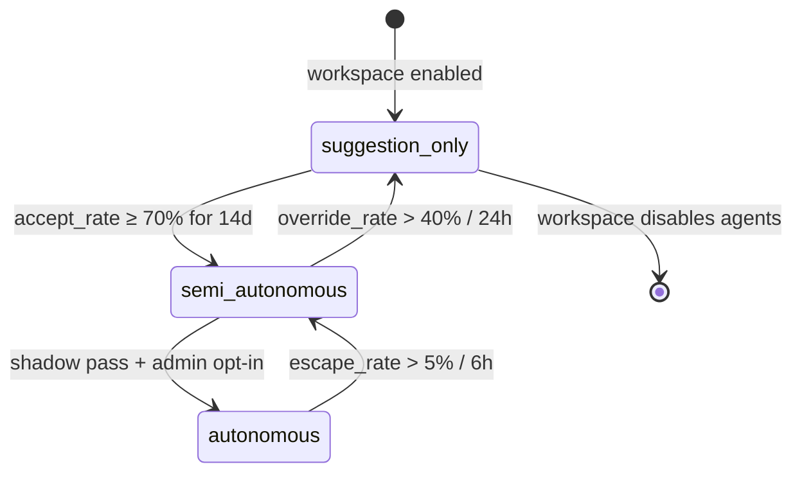

### 7.2 Escalation matrix

| Trigger | Type | Agent behavior |
|---|---|---|
| `confidence < 0.70` | Preview | Draft in UI card |
| P0/P1 triage | Hard | Notify on-call; stop |
| Sprint rebalance | Approval | Wait for PM webhook |
| QA high-risk tags | Hard | Block + QA lead ping |
| External changelog | Approval | 2h timer → remind, not auto-send |
| `version_id` conflict | Arbitration | Suspend; notify workspace admin |
| Agent error rate >5% / 1h | Ops | Auto-pause agent |

### 7.3 Getting work done (end-to-end)

Typical **feature item** lifecycle:

1. **Triage** routes Inbox → Sprint board, assigns engineer (auto or preview).  
2. **Dev Liaison** links PR; syncs "In Review" / "Done" from GitHub.  
3. **Sprint** flags risk mid-sprint; PM approves deferral if needed.  
4. Engineer sets **Ready for QA** → **QA Gate** runs deterministic checks → pass or block.  
5. **Release** aggregates ready items, drafts changelog → manager approves → notify Slack + Doc → archive.

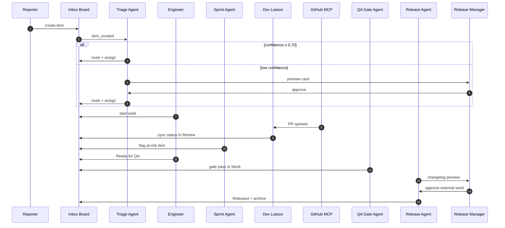

**Done definition:** Item reaches `Released` (or team-defined terminal status) with audit trail, no open `agent_pending_approval`, escape rate within bound.

### 7.4 Autonomy ↔ safety

| Autonomous (low consequence) | Preview / approval (high consequence) |
|---|---|
| Status sync from CI | Cross-sprint moves |
| Flags, nudges, internal summaries | External customer comms |
| Deterministic QA block on failed CI | QA pass on auth/PII |
| Triage when high confidence | Triage when low confidence |

---

## 8. Action Safety (Mutations)

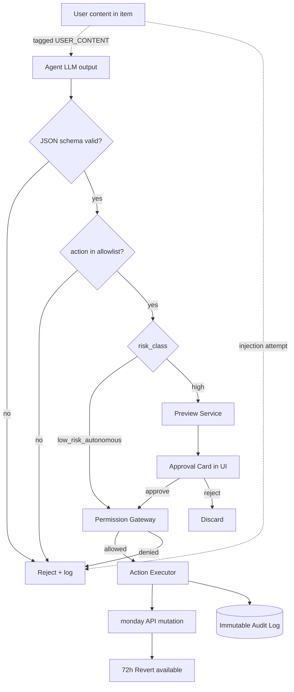

| Control | Mechanism |
|---|---|
| **Permission scope** | Gateway matrix: `agent_id × board_id × action_enum`; product-level ceilings (Triage cannot touch Releases) |
| **Preview** | `PendingAction` record → monday **Approval Card** shows diff (column before/after, target board) |
| **Apply** | Executor runs only `approved` or `low_risk_autonomous` actions |
| **Undo** | `AgentActionRecord.pre_state` + 72h **Revert** for workspace admins |
| **Audit** | Immutable log: `{action_id, agent_id, item_id, pre, post, actor, timestamp}` |
| **Injection** | Tagged user content, schema validation, allowlist enum, no instruction interpolation |

**`PendingAction` fields:** `action_id`, `agent_id`, `item_id`, `diff`, `risk_class`, `expires_at`, `status: pending|approved|rejected`.

---

## 9. Evaluation Methodology

### 9.1 Ground truth construction (not just metrics)

1. **Historical replay:** 6 months anonymized enterprise activity → extract human action sequences per `item_id` (route, assign, sprint move, release approve).  
2. **Ambiguous labels:** 3 senior engineers / workspace archetype; 4-point rubric: `correct | acceptable | suboptimal | wrong`; target Cohen's κ > 0.75.  
3. **Counterfactual QA:** Blocked items linked to post-release defects; false-pass = critical error.  
4. **Synthetic injection set:** Curated prompt-injection cases in item bodies; measure action enum violation rate (target 0).

### 9.2 Per-agent vs team evaluation

| Level | What | Example |
|---|---|---|
| Per-agent | Isolated replay | Triage precision@1 vs human route |
| Team | Emergent behavior | E2E cycle time in sprint simulation |
| Team | Coordination | Conflict rate, cascade failure (disable Dev Liaison) |
| Team | Trust | Override rate by scenario |

### 9.3 LLM-as-judge (Release Agent only)

- Judge: separate model instance from generator.  
- Calibrate on **200** human-rated changelogs; Spearman ρ ≥ 0.80 vs humans.  
- Re-calibrate quarterly or on base-model change.  
- Production: judge score drift alert >0.15 from calibration mean.

### 9.4 Offline → shadow → online

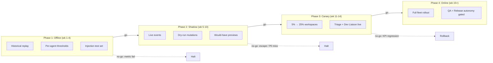

| Phase | Weeks | What runs | Go / no-go |
|---|---|---|---|
| **Offline** | 1–4 | Replay corpus; per-agent thresholds | Any primary metric below §1.1 → stop |
| **Shadow** | 5–10 | Live events; **dry-run** mutations; dashboard for researchers | Escape >5%, P0 miss, permission violation → stop |
| **Canary** | 11–14 | Triage + Dev Liaison live at 5%→25% workspaces | KPI regression → auto-rollback |
| **Online** | 15+ | Sprint/QA/Release per tier; 100% fleet | 30d escape <3% for QA/Release autonomy |

Shadow surfaces **would-have** previews to admins (opt-in) to train trust without risk.

---

## 10. Business / Product KPIs (Team-Level)

| KPI | User/business signal | Measurement |
|---|---|---|
| Cycle time P50/P90 | Efficiency | Cohort: agent-enabled vs control workspaces |
| Manager hours reclaimed | Satisfaction | Survey + approval-time reduction |
| Suggestion acceptance depth | Stickiness | `approved / (approved+rejected)` by agent |
| 90-day workspace retention | Revenue health | Retention diff cohorts |
| Support ticket deflection | Cost | Coordination-tagged tickets |
| Seat expansion correlation | Growth | Agent MAU → seat growth lag 90d |

---

## 11. Critical Concerns

| # | Challenge | Mitigation |
|---|---|---|
| C1 | Permission creep | Non-configurable ceilings at gateway |
| C2 | Context economics | Embed retrieval top-k; `ask_human` tool if recall confidence low |
| C3 | Culture mismatch | Autonomy tier dial; default suggestion-only |
| C4 | Sprint boundary thundering herd | 60s stagger + distributed trace |
| C5 | MCP dependency | Graceful degrade: Dev Liaison read-only, queue events |
| C6 | Judge drift | Quarterly calibration job |

---

## 12. Production Posture

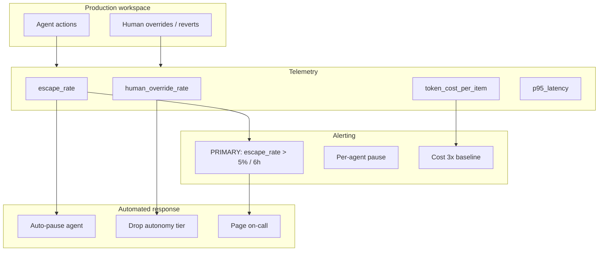

### 12.1 Metrics & alerts

| Metric | Alert if | Action |
|---|---|---|
| **Escape rate** (primary) | >5% rolling 6h | **Page on-call**; auto-pause worst agent |
| Per-agent escape | >8% 6h | Pause that agent |
| LLM error rate | >2% | Fallback suggestion-only |
| P95 action latency | >30s | Scale workers |
| Conflict rate | >1% items/day | Orchestration bug triage |
| Human override rate | >40% 24h | Recalibrate / retrain |
| Token cost / item | >3× baseline | Context audit |
| Injection enum violation | >0 | Sev-2; block executor |

**Primary alert:** **Escape rate** — best early signal of net-negative user work before NPS/support complaints.

### 12.2 Pre-user-complaint detection

Automated signals: revert button usage, `human_override` spike, `agent_pending_approval` expiry without action, cohort cycle-time inversion.

---

## 13. Calibrated Extensions (Out of Scope)

| Extension | Est. impact | Effort |
|---|---|---|
| Cross-workspace portfolio agent for multi-team PMOs | Medium (5% enterprise accounts) | 3w |
| Learned router end-to-end | Low until board heterogeneity high | 2w |
| On-device small model for classify | 30% cost reduction on Triage | 4w |
| Full Sidekick ↔ agent bidirectional plan mode | High UX, risk of duplicate authority | 6w |

---

## 14. MVP Rollout

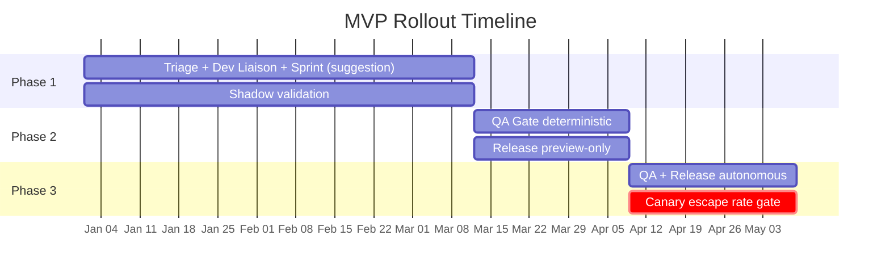

**Phase 1 (shadow-validated):** Triage, Dev Liaison, Sprint (suggestion-only rebalance).  
**Phase 2:** QA Gate deterministic + Release preview-only.  
**Phase 3:** Autonomous QA/Release after 30d canary with escape <3%.

### Diagram index

| # | Section | Diagram |
|---|---|---|
| 1 | §0.1 | Chatbot → co-owned workspace shift |
| 2 | §0.3 | Board flow across agents |
| 3 | §3.1 | Agent topology from Router |
| 4 | §3.2 | Co-ownership & approval gate |
| 5 | §3.3 | Agent handoff sequence |
| 6 | §3.4 | Optimistic locking sequence |
| 7 | §4 | End-to-end pipeline (main architecture) |
| 8 | §6 | Context layering (workspace vs agent) |
| 9 | §7.3 | Feature item lifecycle sequence |
| 10 | §8 | Action safety / preview pipeline |
| 11 | §9.4 | Offline → shadow → canary → online |
| 12 | §12 | Production metrics & alert loop |
| 13 | §14 | MVP Gantt timeline |
| 14 | §7.1 | Autonomy tier state machine |

---

*Document satisfies task.txt sections: team composition, pipeline diagram, per-agent design, context layering, HITL, evaluation (ground truth, rubric, calibration, offline→shadow→online), business KPIs, critical concerns, metric-first, failure criteria, ablations, action safety (preview/undo/audit/injection), production alerts, hybrid co-ownership, monday product surfaces, i18n/RTL, and getting work done.*
