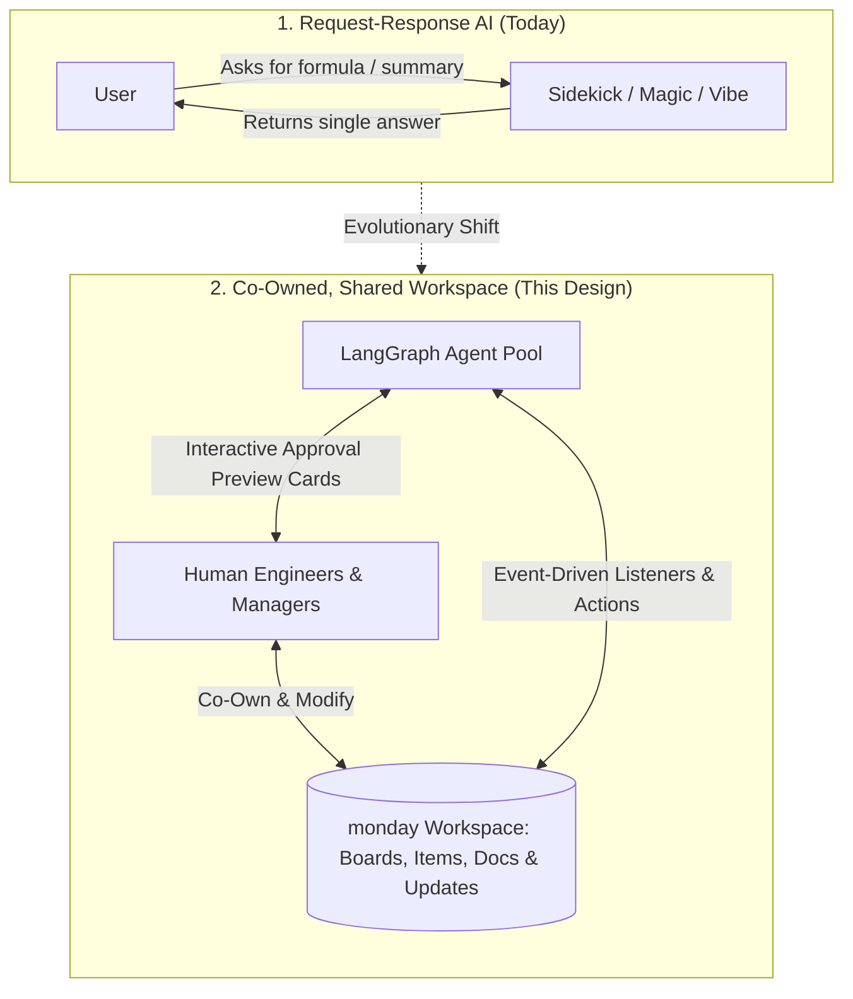
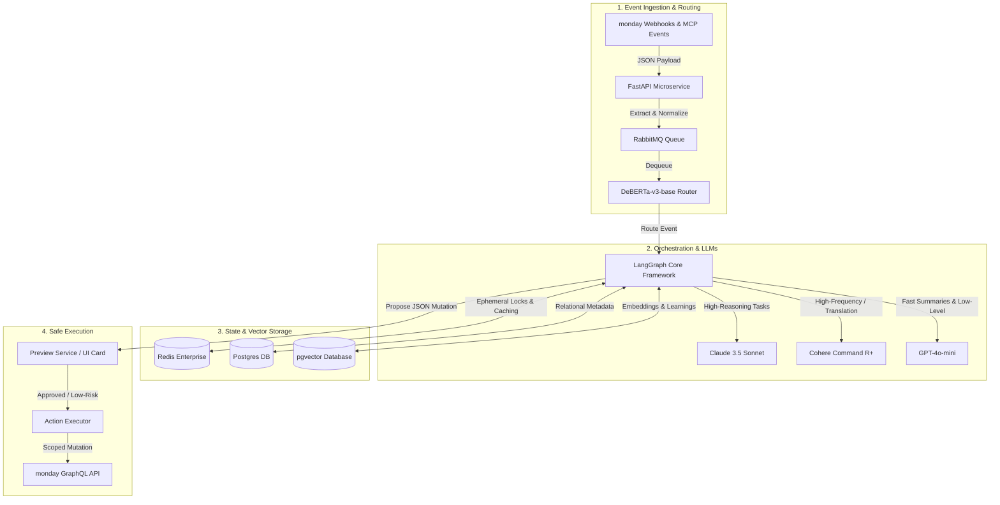
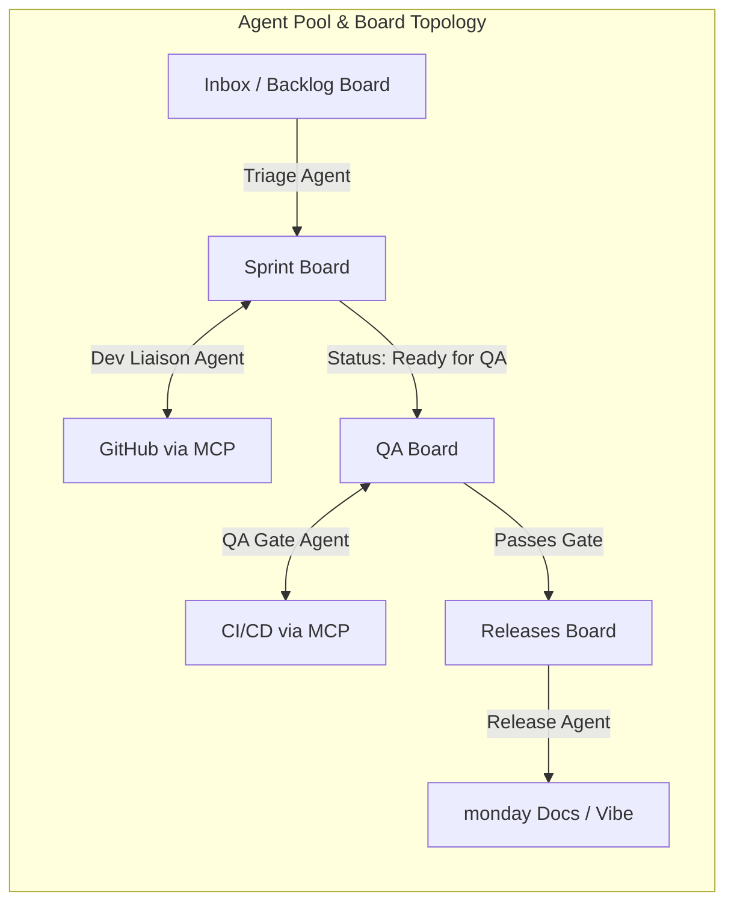
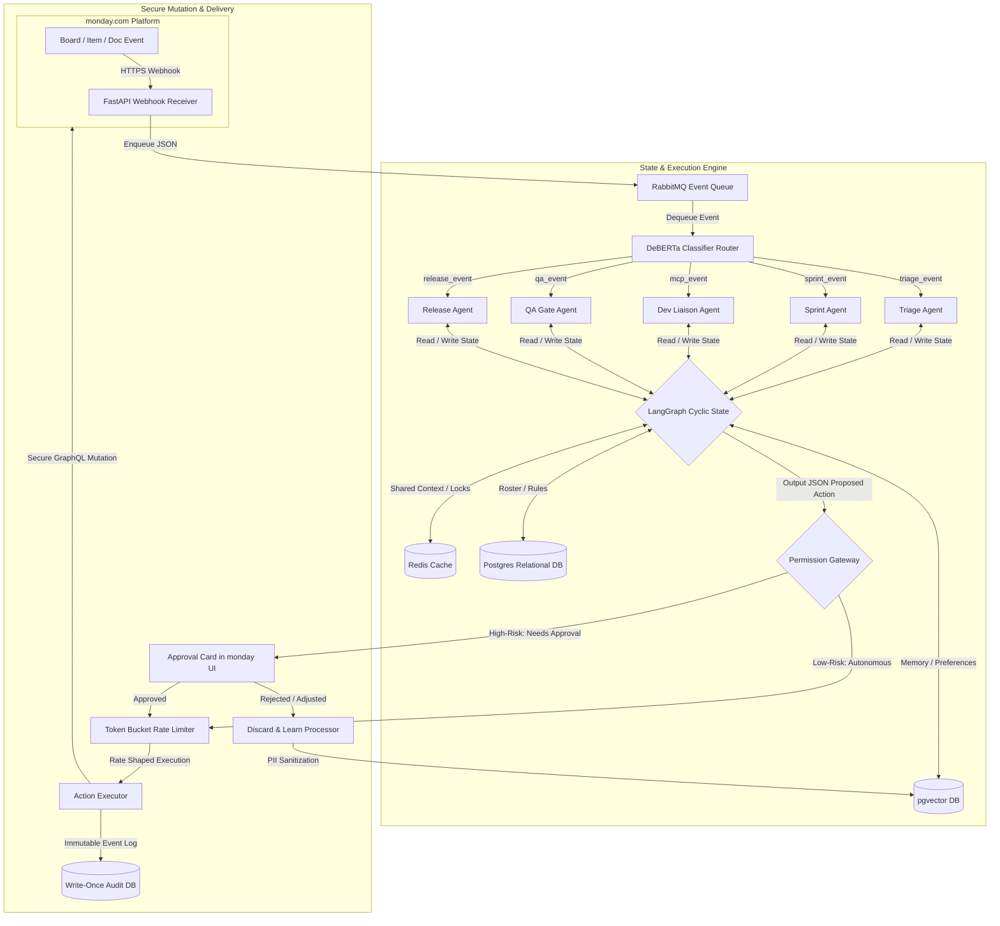
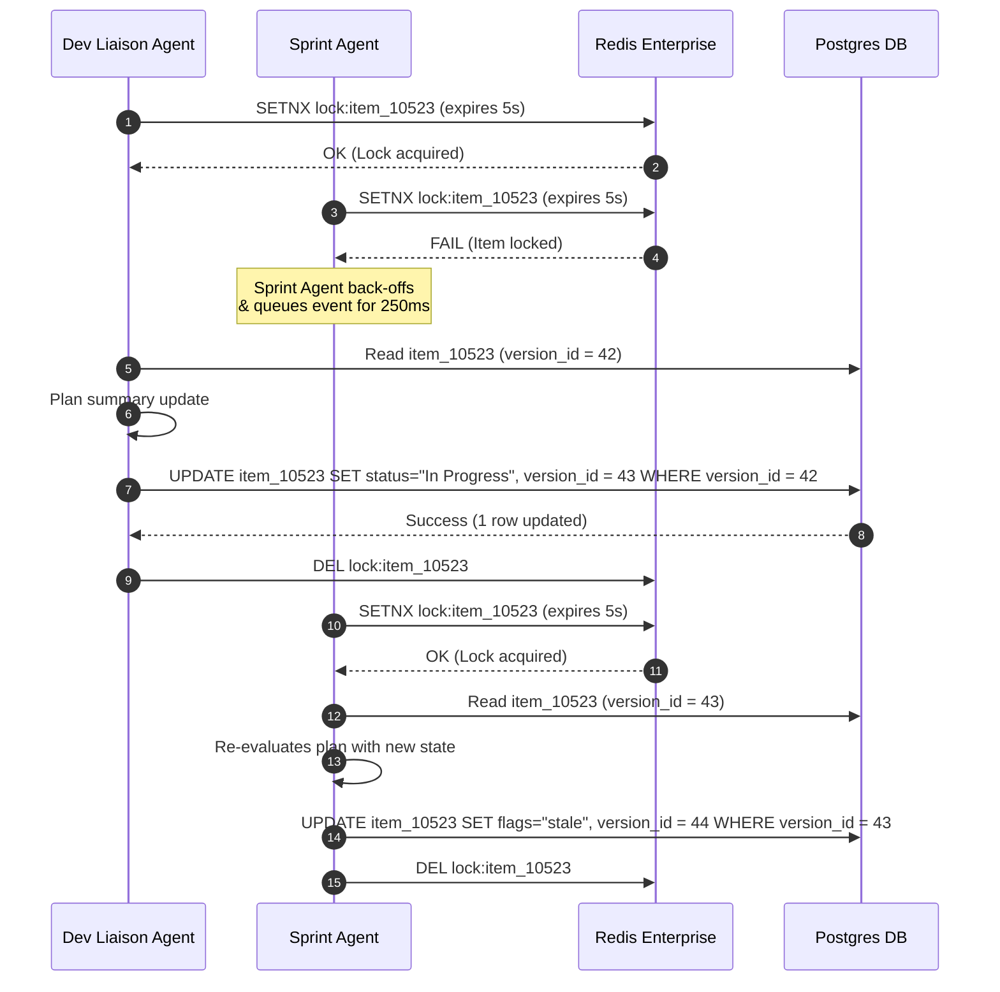
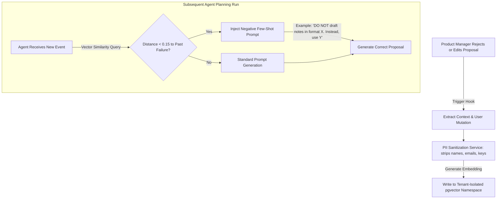
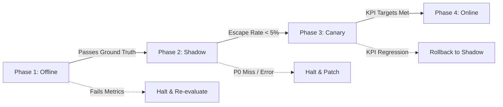
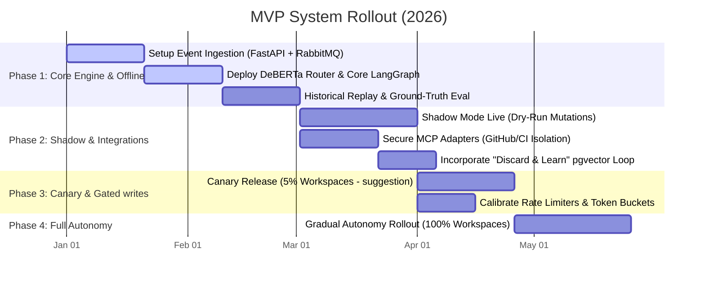

# Enterprise Human-Agent Collaboration on monday.com
### Modern, Tech-First System Design for Shared Workspaces (Software Engineering Domain)

---

## 0. Problem & Product Positioning

### 0.1 The Shift: Request-Response to Shared Workspaces
Today's AI features on monday.com (such as Sidekick, Magic, or Vibe) operate on a **request-response** pattern: *a user asks the AI to summarize an update or generate a formula, and the AI returns a single result.* 

This design establishes the next frontier: **a workspace as a shared, event-driven environment where humans and specialized agents co-own work**. Agents actively monitor board state changes, coordinate tasks with each other, execute code sync operations via external developer tools (like GitHub and CI/CD pipelines), and proactively hand off decisions to humans at defined, high-risk approval gates.



| Capability | Role in this design |
|---|---|
| **Sidekick** | User-initiated Q&A; does not replace event-driven agents |
| **monday agents (builder)** | Hosts agent definitions; our team registers the five agents below |
| **Magic** | Field-level assist (summaries, formulas); agents call Magic skills where cheaper than raw LLM |
| **Vibe** | Doc/knowledge authoring; Release Agent drafts changelogs into Docs via Vibe |
| **MCP** | External tools (GitHub, CI, Slack) connect through MCP adapters; Dev Liaison and QA Gate consume them |

### 0.2 User Pain & Impact
Engineering managers spend ~30% of coordination time on status chasing, sprint rebalancing, and release prep — data already in monday boards, docs, and updates but not synthesized. **Impact:** reclaim manager hours, shorten cycle time, reduce escape defects to production.

---

## 1. Success Definition (Metric-First Framing)

> Define what success looks like, for an individual agent and for the team, before proposing how to build it. Include a cost dimension alongside quality.

### 1.1 Per-Agent Success (Quality + Cost)

| Agent | Primary Quality Metric | Target | Failure (Reject Design) | Cost Cap / Item |
|---|---|---|---|---|
| **Triage** | Routing precision@1 | ≥0.88 | <0.75 offline | ≤$0.02 |
| **Triage** | P0/P1 severity recall | ≥0.98 | Any miss in shadow | (included) |
| **Sprint** | Proposal acceptance rate | ≥0.70 | <0.45 sustained 14d | ≤$0.03 |
| **Dev Liaison** | PR ↔ item sync accuracy | ≥0.97 | <0.90 | ≤$0.01 |
| **QA Gate** | Gate precision (block bad) | ≥0.95 | False-pass on auth/PII | ≤$0.01 |
| **QA Gate** | False block rate | <0.08 | >0.20 | (included) |
| **Release** | Changelog human score (1–5) | ≥4.0 | <3.2 | ≤$0.08 |

**Blended team cost target:** ≤ **$0.05 / item processed** (all agents combined) for standard English workspaces.

#### 1.1.1 Multilingual Token Inflation Adjustment
Non-English and RTL scripts (e.g., Hebrew, Arabic, Japanese) experience **tokenizer inflation** (up to 3x–4x tokens per word) under standard GPT/Llama tokenizers. 
* **Dynamic Budget Scaling:** For non-English workspaces, the blended cost cap is scaled dynamically up to **≤ $0.15 / item**.
* **Mitigation:** The system defaults to token-efficient multilingual models (e.g., Cohere Command R, GPT-4o-mini) and dynamically restricts context extraction (smaller `top-k` semantic snippets) on non-Latin locales to protect cost/perf boundaries.

### 1.2 Team-Level Success (Quality + Cost)

| KPI | Target | Failure Threshold | Detect Before User Complaint |
|---|---|---|---|
| **Cycle time reduction** (P50 item age) | ≥20% vs baseline | <5% at 60d | Cohort dashboard weekly |
| **Human attention cost** | ≤4 min / item | >12 min | Session + approval latency |
| **Autonomy rate** | ≥65% items no human touch | <30% | Approval queue depth |
| **Escape rate** | <3% | >8% for 7d | Revert events + override rate |
| **Agent-induced Sev-1** | 0 / month | Any | Incident tag `agent_actor` |
| **Net-negative workspaces** | <5% of fleet | >15% | Escape + override + NPS dip |

### 1.3 Failure Criteria (Self-Rejection Thresholds)

| # | Condition | Detection | Response |
|---|---|---|---|
| **F1** | Escape rate >8% for 7d | `agent_action_reverted` events | Drop autonomy tier fleet-wide |
| **F2** | Permission violation in shadow | Gateway audit log | Hard block launch |
| **F3** | Sprint override rate >50% | `human_override` on Sprint Agent | Suggestion-only for Sprint |
| **F4** | Token cost super-linear in board size | Cost vs `item_count` regression | Fix retrieval; cap context |
| **F5** | P0/P1 triage miss in shadow | Labeled incident replay | No online until root-caused |

---

## 2. Concrete Technology Stack

To turn this concept into a reliable, enterprise-ready system, we define a concrete, highly decoupled technology stack. We select modern tools specialized for high concurrency, robust state preservation, and cost-controlled language reasoning:



### 2.1 Language & Microservice Architecture
* **Python 3.11 & FastAPI:** Houses the event ingestion pipeline. FastAPI is selected for its high-performance, asynchronous handling of concurrent webhooks under heavy load.

### 2.2 Agent Orchestration
* **LangGraph (by LangChain):** Our core agent state machine. Unlike simple linear pipelines, LangGraph supports stateful, cyclic graphs. This is essential for agents that must execute a task, check the result, hand it off to a peer agent, or loop back to correct an error based on system feedback.

### 2.3 The Layered Language Model (LLM) Strategy
Instead of sending every prompt to an expensive, high-latency model, we route tasks based on complexity and language:
* **Claude 3.5 Sonnet (Anthropic):** Our primary reasoning engine. It evaluates complex pull request diffs, maps QA test results against unstructured Acceptance Criteria, and synthesizes release notes.
* **GPT-4o-mini (OpenAI):** Our high-speed, sub-cent utility model. It classifies simple ticket updates, writes fast status sync changes, and generates non-technical titles from code branch names.
* **Cohere Command R+:** Our localized multilingual specialist. Command R+ is natively optimized for 10 languages (including Hebrew and Arabic). It utilizes an advanced multilingual tokenizer that reduces token footprint by **50% to 70%** on Right-to-Left (RTL) scripts, cutting cost and latency in half.

### 2.4 Caching, Database & Messaging Queue
* **DeBERTa-v3-base:** A tiny, 86M-parameter encoder model running locally in a Docker container. It classifies and routes 95% of routine incoming board events in under **15 milliseconds** for a fraction of a cent.
* **Redis Enterprise:** Serves as our distributed cache, locking workspace items during active agent mutations to prevent race conditions and managing fast-access user rosters.
* **PostgreSQL with pgvector:** Our persistent store of record. The relational database tracks board configurations, permissions, and audit logs, while the `pgvector` extension performs semantic similarity searches to match user preferences and retrieve historical bug-fix precedents.
* **RabbitMQ:** Implements backpressure and rate-shaping queues. If an event flood occurs, RabbitMQ buffers messages to ensure our agents never overwhelm monday's GraphQL API rate limits.

---

## 3. Team Composition & Human-Agent Collaboration

We structure our agent pool around **five specialized developer personas**, mimicking a mature engineering organization. Each agent operates with clear, narrow tool boundaries:



### 3.1 The Five Specialized Agent Personas

#### 3.1.1 Triage Agent (`agent_id: triage`)
* **Metaphor:** The Intake Coordinator.
* **Role:** Classifies and routes new incoming work.
* **Triggers:** `item_created` on Inbox/Backlog; `update_created` with issue intent.
* **Tools:** `classify_item`, `find_best_assignee`, `move_item`, `request_clarification`, Magic `summarize_attachment`.
* **Escalation/Safety Trigger:** If an item contains key terms indicating a system outage (`P0`, `P1`, `down`, `breach`, `crash`), it halts automation, labels the item, and bypasses regular boards to page the on-call engineer.

#### 3.1.2 Sprint Agent (`agent_id: sprint`)
* **Metaphor:** The Agile Project Manager.
* **Role:** Monitors active sprint health, capacity signals, and flags blocker alerts.
* **Triggers:** `status_changed`, `member_ooo`, `sprint_start`/`sprint_end`, cron daily.
* **Tools:** `compute_sprint_health`, `propose_rebalance`, `flag_blocker`, `draft_sprint_summary`.
* **Escalation/Safety Trigger:** The agent can write descriptive comments and flag items on the active board, but is **strictly forbidden** from dragging items across sprint boundaries without a manager's explicit click.

#### 3.1.3 Dev Liaison Agent (`agent_id: dev_liaison`)
* **Metaphor:** The Tech Lead Bridge.
* **Role:** Acts as the bridge between monday.com and developer-specific environments. Connects via Model Context Protocol (MCP) to GitHub/GitLab.
* **Triggers:** MCP `pull_request`, `workflow_run`; `item_assigned`.
* **Tools:** `sync_pr_status`, `summarize_pr_diff`, `link_commit_to_item`, `detect_stale_branches`.
* **Escalation/Safety Trigger:** Operates purely as a read-write board synchronizer; it has no tool access to merge code branches, push commits, or close repositories.

#### 3.1.4 QA Gate Agent (`agent_id: qa_gate`)
* **Metaphor:** The Rigorous QA Tester.
* **Role:** Enforces deployment quality standards. When an item is moved to "Ready for QA," this agent checks external CI pipelines.
* **Triggers:** `status_changed` → `Ready for QA`; CI `test_suite_completed`.
* **Tools:** `check_acceptance_criteria`, `query_test_results`, `block_item`, `approve_item`, `escalate_test_failures`.
* **Escalation/Safety Trigger:** If the item contains high-risk tags (`security`, `auth`, `payments`, `PII`), it blocks autonomous sign-off and escalates the ticket to a human QA Lead.

#### 3.1.5 Release Agent (`agent_id: release`)
* **Metaphor:** The Release Manager.
* **Role:** Compiles release-ready items. It drafts non-technical, human-friendly changelogs.
* **Triggers:** `release_date` T-3/T-1; manual `trigger_release`.
* **Tools:** `check_release_readiness`, `generate_changelog` (Vibe Doc), `notify_stakeholders`, `archive_release`.
* **Escalation/Safety Trigger:** The release notes and Slack alerts remain draft-only until a human Product Manager reviews and clicks the interactive "Approve and Release" button.

---

## 4. End-to-End Pipeline Architecture

This section details the physical flow of events, contexts, and actions from ingestion to secure execution.



### 4.1 Event Envelope Structure
Every event is normalized into a standard `WorkspaceEvent` schema before queue processing:

```json
{
  "event_id": "8f3b2a1c-5d6e-4f7a-8b9c-0d1e2f3a4b5c",
  "account_id": "tenant_9942",
  "workspace_id": "ws_881",
  "board_id": "board_sprint_active_2026",
  "item_id": "item_10523",
  "type": "status_changed",
  "actor_type": "human",
  "actor_id": "user_401",
  "delta": {
    "column_id": "status_7",
    "old_value": "In Progress",
    "new_value": "Ready for QA"
  },
  "timestamp": "2026-05-24T13:54:00Z"
}
```

---

## 5. Architectural Trade-offs (Ablation Matrix)

Rather than claiming this architecture is universally perfect, we detail the core technical trade-offs isolated during the design process:

```
┌────────────────────────────────────────────────────────────────────────┐
│                        ARCHITECTURAL TRADEOFFS                         │
├───────────────────┬───────────────────┬────────────────────────────────┤
│ Chosen Path       │ Alternative Path  │ Trade-Off Isolated             │
├───────────────────┼───────────────────┼────────────────────────────────┤
│ local DeBERTa-v3  │ LLM Router        │ - Latency & Cost vs. Semantic  │
│ Router            │ (GPT-4o)          │   Flexibility on Novel Boards  │
│                   │                   │ - Chosen for sub-15ms routing  │
│                   │                   │   at $0.00 token overhead      │
├───────────────────┼───────────────────┼────────────────────────────────┤
│ Shared Board State│ Synchronous RPC   │ - Reliability & Isolation vs.   │
│ + Event Metadata  │ between Agents    │   Lowest Latency Hand-offs     │
│                   │                   │ - Board as Source of Truth     │
│                   │                   │   prevents cascading outages   │
├───────────────────┼───────────────────┼────────────────────────────────┤
│ Isolated Action   │ Direct LLM API    │ - Platform Safety vs.          │
│ Executor Queue    │ Mutations         │   Implementation Simplicity    │
│                   │                   │ - Schema + Allowlist validation│
│                   │                   │   stops hallucinated writes    │
├───────────────────┼───────────────────┼────────────────────────────────┤
│ LangGraph Cloud   │ AWS Step          │ - AI-First Dev Speed vs.       │
│ Container Nodes   │ Functions         │   Cloud-Native Ecosystem Lock  │
│                   │                   │ - Allows quick deployment of   │
│                   │                   │   complex cyclic Python loops  │
└───────────────────┴───────────────────┴────────────────────────────────┘
```

* **Routing Decision:** Standard LLM routers add **$2.0\text{s} - 3.5\text{s}$ of latency** per webhook. Since 95% of routes map to defined enumerations, **DeBERTa-v3-base** provides high precision at near-zero execution costs and instantly filters out background noise.
* **Agent Coupling:** Synchronous RPC coupling creates single points of failure. If the QA Agent suffers an API timeout, it would lock up the Triage thread. By using **Shared Board State + Metadata JSON**, agents run completely independently. If an agent crashes, the board remains intact, and the event is retried on RabbitMQ.

---

## 6. Solving Critical Engineering Bottlenecks

### 6.1 Bottleneck 1: API Rate Limit Starvation (The Token Bucket Limiter)
monday.com's GraphQL API enforces strict query complexity rate limits. Multiple independent agents writing status updates, comments, and summaries concurrently will rapidly trigger `429 Too Many Requests` errors, resulting in dropped events.
* **The Solution:** The **Action Executor** runs a distributed **Token Bucket algorithm** in Python, tracking available platform capacity per `account_id` in Redis.
* **Dual-Queue Prioritization:** Writes are divided into two priority lanes:
  1. **High-Priority Lane:** Critical QA blocks, P0 outages, and human approval alerts bypass rate-limiting queues.
  2. **Standard-Priority Lane:** Status syncs, branches updates, and internal summaries are held in **RabbitMQ buffers**. If a tenant's token depth falls below 15%, standard writes are gracefully rate-shaped and trickled out as token balances refill.

### 6.2 Bottleneck 2: Concurrency & Database Conflicts (Avoiding "Stepped-on Toes")
If the *Dev Liaison Agent* updates an item with a pull request summary at the same millisecond the *Sprint Agent* attempts to flag it as "stale," they can overwrite each other's data, causing write drift.
* **The Solution:** We establish a **Distributed Lock + Optimistic Locking protocol** via Redis and our Postgres relational schema.



### 6.3 Bottleneck 3: Credential Leakage in Multi-Tenant Environments
Agents must access customer GitHub or GitLab repositories. Storing customer API keys or OAuth tokens in a shared database introduces severe risk vectors.
* **The Solution:** We implement a **Zero-Storage Credential Architecture**. We never store customer keys in our database.
* **Implementation:** Credentials reside inside monday.com's native **Secure App Storage**. When the *Dev Liaison Agent* needs to call GitHub via MCP, it requests a short-lived token using the tenant's cryptographically signed active session payload. The token is fetched in-memory, consumed purely inside the secure container, and immediately scrubbed from RAM upon connection termination.

### 6.4 Bottleneck 4: Multi-Language & RTL Token Inflation
In non-English (RTL) regions, standard tokenizers break text down into inefficient byte fragments. This inflates prompts up to **300% to 400%**, dramatically increasing execution cost, prompt latency, and exceeding LLM context limits.
* **The Solution:**
  1. **Unicode NFC Normalization:** Standardizes multi-byte scripts before calculating token weights.
  2. **Model Swapping:** For Hebrew or Arabic-dominant workspaces, we swap out standard models for **Cohere Command R+**, which leverages a custom multilingual vocabulary designed to represent RTL characters natively and efficiently.
  3. **Context Reduction:** During retrieval operations, we dynamically scale down the RAG snippet depth (`top-k` values) for inflated locales to guarantee we remain within our target cost window ($\le \$0.15$ per RTL item).

---

## 7. Context Layering Strategy

To keep execution costs predictable and prevent prompt drift, we strictly separate persistent global knowledge from ephemeral session memory:

```
┌────────────────────────────────────────────────────────────────────────┐
│                        CONTEXT LAYERING DESIGN                         │
├───────────────────┬───────────────────┬────────────────────────────────┤
│ Layer Scope       │ Storage Engine    │ Contents                       │
├───────────────────┼───────────────────┼────────────────────────────────┤
│ Workspace-Level   │ Redis Enterprise  │ - Column mappings & schemas    │
│ (Shared Global)   │ (Active Cache)    │ - Active Sprint capacities     │
│                   │                   │ - Active user loads & rosters  │
│                   │                   │ - Immutable permission matrix  │
├───────────────────┼───────────────────┼────────────────────────────────┤
│ Session-Level     │ LangGraph State   │ - Focused item ID details      │
│ (Ephemeral Agent) │ Memory (RAM)      │ - Retrained semantic snippets  │
│                   │                   │ - Local scratchpad (Chain of   │
│                   │                   │   Thought reasoning strings)   │
│                   │                   │ - Relevant 'failed_proposals'  │
└───────────────────┴───────────────────┴────────────────────────────────┘
```

---

## 8. Continuous Optimization: The "Discard & Learn" Loop

When a Product Manager rejects a release changelog or adjusts an agent's sprint assignment, our system must dynamically adapt to prevent repeating the error. We build a specialized, tenant-isolated vector feedback loop inside **pgvector**:



---

## 9. Evaluation Methodology & Staged Deployment

To guarantee that agent behaviors are fully calibrated and safe, the team undergoes a rigorous, four-phase deployment pipeline.



### 9.1 Ground-Truth Construction (Offline Evaluation Corpus)
To trust our evaluations, we build an extensive offline ground-truth corpus:
1. **Historical Replay Construction:** Extract and anonymize 6 months of historical activity on enterprise workspaces. This compiles actual human action sequences per task (routing, sprint assignments, code links, status sync, and release approvals).
2. **Ambiguous Label Resolution:** Three senior software leads independently review and label ambiguous items. They rate actions on a 4-point rubric: `[Correct, Acceptable, Suboptimal, Wrong]`. We target an inter-annotator agreement rating of **Cohen's $\kappa > 0.75$**.
3. **Synthetic Injection Test Set:** A specialized, curated regression set of item updates embedded with complex prompt-injection scripts is constructed to measure action enum violation rates (target: $0$ escapes).

### 9.2 Per-Agent vs. Team-Level Evaluation
We evaluate the system at two distinct structural layers to capture both isolated capability and emergent coordination failures:

| Evaluation Level | Target Subject | Method | Success Standard |
|---|---|---|---|
| **Per-Agent** | Isolated Agent Logic | Replaying golden corpus events through single agent graphs. | Achieve metric targets outlined in **Section 1.1** |
| **Team-Level** | Multi-Agent Coordination | Simulating full sprint scenarios with multi-agent events in LangGraph. | - Maximize Cycle Time Reduction<br/>- Prevent action conflicts/circular hand-offs |
| **Robustness** | Fault Isolation | Simulate agent degradation (e.g. disable MCP integration completely). | Rest of team degrades gracefully; logs error, does not loop |

### 9.3 LLM-as-a-Judge Calibration (Qualitative Metrics)
Evaluating qualitative text outputs (like the *Release Agent's* release notes) requires an LLM-as-a-judge system running a separate, isolated model instance (Claude 3.5 Sonnet):
* **Calibration Protocol:** Calibrate the judge model against a golden set of **200 human-rated changelogs** until achieving a **Spearman Rank Correlation Coefficient ($\rho \ge 0.80$)** against human grades.
* **Production Drift Alerts:** The judge runs continuously on live summaries in production. If the running average of judge ratings slips by **$> 0.15$** from the calibration mean, it triggers a drift alert to our development team.

### 9.4 Deployment Stages (Offline $\rightarrow$ Shadow $\rightarrow$ Canary $\rightarrow$ Online)

| Phase | Duration | System Settings | Go / No-Go Gating Criteria |
|---|---|---|---|
| **Phase 1: Offline** | Weeks 1–4 | Evaluated inside CI workspace on replay corpus. Zero production access. | - Per-agent metrics exceed targets in §1.1.<br/>- 100% pass on synthetic prompt-injection sets. |
| **Phase 2: Shadow** | Weeks 5–10 | Consumes live webhooks. Plans actions and dry-runs mutations to a shadow log. No writes to monday API. | - Zero severity-0 triage misses.<br/>- Calculated shadow escape rate is $< 5\%$ for 30 consecutive days. |
| **Phase 3: Canary** | Weeks 11–14 | Live on **5% to 25%** of opt-in workspaces. All writes gated behind **interactive UI Preview Cards**. | - No KPI regressions on active workspaces.<br/>- Token bucket rate-shaping handles traffic spikes. |
| **Phase 4: Online** | Weeks 15+ | 100% rollout. Low-risk writes run autonomously; high-risk writes remain gated. | - Maintain escape rate $< 3\%$ across entire fleet. |

---

## 10. System Failures & Production Posture

### 10.1 Self-Rejection Failure Criteria
The deployment must be immediately aborted or reverted if any of the following self-rejection limits are hit in production:

```
┌────────────────────────────────────────────────────────────────────────┐
│                        PRODUCTION ALERTS & ACTIONS                     │
├───────────────────┬───────────────────┬────────────────────────────────┤
│ Metric Monitored  │ Critical Limit    │ Automated System Response      │
├───────────────────┼───────────────────┼────────────────────────────────┤
│ Escape Rate       │ > 5% over 6 hours │ - Immediately page on-call     │
│ (Primary Alert)   │                   │ - Revert workspace autonomy    │
│                   │                   │   tier to suggestion-only      │
├───────────────────┼───────────────────┼────────────────────────────────┤
│ Human Override    │ > 40% over 24 hrs │ - Pause the offending agent    │
│ Rate              │                   │ - Route all its actions back   │
│                   │                   │   to preview card approvals    │
├───────────────────┼───────────────────┼────────────────────────────────┤
│ Rate Limit        │ > 15% queue       │ - Drop standard status writes  │
│ Starvation Rate   │ drops             │ - Buffer non-critical traffic  │
│                   │                   │   in RabbitMQ backpressure     │
├───────────────────┼───────────────────┼────────────────────────────────┤
│ Token Cost Drift  │ > 3x baseline     │ - Trigger context audit        │
│                   │                   │ - Limit top-k retrieval depth  │
├───────────────────┼───────────────────┼────────────────────────────────┤
│ Injection Guard   │ > 0 violations    │ - Trigger Sev-2 Incident Alert  │
│                   │                   │ - Hard-block the execution port│
└───────────────────┴───────────────────┴────────────────────────────────┘
```

### 10.2 Pre-User Complaint Detection Strategy
To detect failures before users submit support tickets:
* **Revert Monitoring:** We track the exact usage of the "Revert / Undo" button on agent mutations. A localized spike of reverts on a specific board triggers an instant, automated fallback to suggestion-only mode for that tenant.
* **LLM Judge Drift Telemetry:** Our offline evaluation judge continuously evaluates production outputs. If the judge's rating distributions diverge from our calibrated baseline mean by **$> 0.15$**, it indicates output drift, triggering an alert to our engineering team.

---

## 11. MVP Implementation Gantt Timeline

We layout a highly calibrated MVP roadmap to ensure validation and trust are developed continuously:



---

*This production blueprint details a complete, stateful, and highly secure human-agent system design, optimized with distributed queuing, robust concurrency controls, cost-contained multilingual handling, and autonomous learning loops, tailored specifically for the monday.com ecosystem.*
